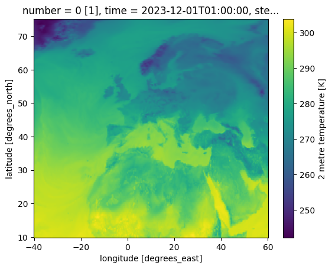

# Weather prediction using DeepLearning

This repository aims to predict weather patterns using the ERA5 dataset.

### Dataset

Link: [https://cds.climate.copernicus.eu/datasets/reanalysis-era5-single-levels]()

Dataset example:

